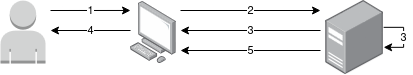
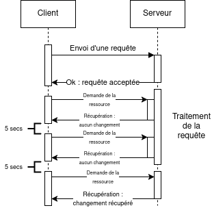
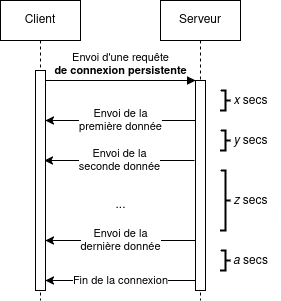

# Processus asynchrone

1. [Différences avec un processus synchrone](#différences-avec-un-processus-synchrone)
2. [Avantages et inconvénients](#avantages-et-inconvénients)
3. [Quand utiliser un fonctionnement asynchrone](#quand-utiliser-un-fonctionnement-asynchrone)
4. [Quels moyens de récupérer une information](#quels-moyens-de-récupérer-une-information)
5. [Considérations non-techniques](#considérations-non-techniques)
6. [En conclusion](#en-conclusion)

---

## Différences avec un processus synchrone

Dans le cas d'un processus synchrone, lorsqu'un utilisateur utilise une interface pour envoyer une requête quelconque,
sa réponse arrivera dès que le serveur aura terminé de la traiter.

1. L'utilisateur utilise l'interface de l'application pour exécuter une action,
   1. Il va alors attendre le traitement de la requête.
2. Une requête est envoyée au serveur,
3. Le serveur la traite,
4. Le serveur renvoie une réponse,
5. L'utilisateur peut de nouveau continuer d'utiliser l'application.

En revanche, dans le cas d'un processus asynchrone, le serveur répond qu'il a tenu compte de la requête lors de sa
réception. Cela lui permettra de la traiter à un moment opportun et surtout de redonner la main à l'utilisateur, qui
pourra continuer d'utiliser le produit.

1. L'utilisateur utilise l'interface de l'application pour exécuter une action,
   1. Pareillement, il va attendre le traitement de la requête pour récupérer la main.
2. Une requête est envoyée au serveur,
3. Le serveur la prend en compte et renvoie à l'utilisateur que sa requête va être traitée,
4. L'utilisateur a de nouveau la main pour manipuler l'interface,
5. Le serveur a terminé de traiter la requête et le résultat est disponible.

Pour résumer les différences :

1. Le serveur rend la main à l'utilisateur afin qu'il puisse continuer d'utiliser l'application,
2. Le serveur choisit le moment le plus opportun pour traiter la requête,
3. La réponse n'est pas renvoyée aussitôt, mais peut être récupérée dans un second temps par l'utilisateur.
   1. Comme indiqué [plus bas](#quels-moyens-de-récupérer-une-information), la réponse pourra également être renvoyée
      l'utilisateur dans un temps indéfini.

## Avantages et inconvénients

### Avantages

Un mode de fonctionnement asynchrone a plusieurs avantages pour l'utilisateur. Le premier est le fait qu'il peut
continuer d'utiliser le produit sans pour autant attendre la fin d'un processus à durée indéterminée (exemple : import
de fichiers, attente de réponse d'un fournisseur tierce, etc.).

Un second avantage est qu'il est possible pour le serveur de paralléliser les tâches asynchrones, afin de les exécuter
à un moment différé, où les ressources ne sont pas mobilisées pour l'utilisateur, offrant ainsi un temps de réponse bas.

Cela amène donc à une performance globale supérieure aux processus synchrones : temps d'attente limité pour
l'utilisateur, tout le travail se fait côté serveur.

### Désavantages

Un premier désavantage de ce type de fonctionnement est la **fraîcheur des données** : le temps de traitement pouvant
être indéfini, il faudra récupérer dans un second temps les données les plus à jour. Cela pourra être contraignant si ce
fonctionnement se fait dans le cadre d'un processus bloquant.

Un autre désavantage est la récupération de ces données. Dans le cas d'un processus synchrone, la donnée à jour revient
suite à la requête envoyée et elle pourra être présentée à l'utilisateur. Dans le cas d'un processus asynchrone, il
faudra prévoir un [mécanisme de récupération](#quels-moyens-de-récupérer-une-information) supplémentaire, qui pourra
impacter l'expérience utilisateur et la complexité technique de l'application.

La gestion des erreurs est également l'un des désavantages. Il faudra se poser les questions suivantes lors de la
conception du parcours utilisateur : comment notifier d'un traitement qui a échoué, faut-il permettre la reprise du
processus, etc. Cela pourra avoir des impacts sur l'expérience utilisateur.

### En synthèse

| Avantages                        | Inconvénients                                              |
|----------------------------------|------------------------------------------------------------|
| Non-bloquant pour l'utilisateur  | Fraîcheur des données                                      |
| Possibilité d'exécution différée | Récupération des données                                   |
| Souvent performant               | Complexité technique variable selon les solutions choisies |
|                                  | Gestion des erreurs                                        |

## Quand utiliser un fonctionnement asynchrone

Voici quelques éléments qui pourraient indiquer qu'un mode de fonctionnement asynchrone serait pertinent :

- Nous avons une tâche qui prend plusieurs secondes avant de se terminer (au moins environ 10 secondes) ou nous ne
  savons au bout de combien de temps elle pourra aboutir,
- Nous faisons appel à des systèmes (tierces) qui ont un temps de réponse élevé, ou indéfini,
- Des systèmes tierces ont eux-mêmes un fonctionnement asynchrone et nous devons avoir un fonctionnement compatible pour
  s'intégrer avec eux.

Ces éléments sont en général fréquents dans des applications de type e-commerce.

À noter que lorsqu'il est possible de ne pas avoir de processus asynchrone, il est préférable de s'en passer.

## Quels moyens de récupérer une information

### Requêtes à intervalles réguliers, ou "polling"

Le principe de ce moyen est de faire une requête à intervalles réguliers au serveur afin de récupérer les dernières
informations.

Pour un intervalle de 5 secondes :

- Le client effectue une requête,
- Le serveur répond qu'elle a été prise en compte,
- Le serveur la traite,
- Le client effectue toutes les 5 secondes une requête pour vérifier la présence du résultat,
- Si le résultat n'est pas prêt, le client effectue un nouvel essai 5 secondes plus tard,
- Si le résultat est disponible, le client peut arrêter de re-demander et traite l'information.

Si la ressource est mise à jour par une autre source, alors le polling peut continuer pour récupérer la donnée la plus à
jour, jusqu'à quitter la page.

Les avantages de cette manière sont que ce n'est pas coûteux et facile à implémenter.

En revanche, si l'information n'est pas disponible rapidement, le client va lancer un certain nombre de requêtes afin
d'obtenir ce qu'il veut. De plus, l'utilisateur devra rester sur son application, voire sa page, pour récupérer
l'information. Enfin, cette application doit avoir au moins 2 points d'entrées : l'un pour lancer un traitement, et un
nombre suffisant pour récupérer les autres informations.

### Connexion persistante unidirectionnelle, ou "Server-sent events"

### Connexion persistante bidirectionnelle, ou "Websockets"

### Notifications push

## Considérations non-techniques

## En conclusion
