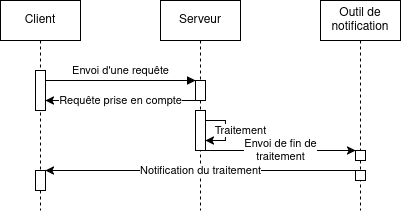

# Processus asynchrone

1. [Différences avec un processus synchrone](#différences-avec-un-processus-synchrone)
2. [Avantages et inconvénients](#avantages-et-inconvénients)
3. [Quand utiliser un fonctionnement asynchrone](#quand-utiliser-un-fonctionnement-asynchrone)
4. [Quels moyens de récupérer une information](#quels-moyens-de-récupérer-une-information)
5. [Considérations non-techniques](#considérations-non-techniques)
6. [En conclusion](#en-conclusion)

---

## Différences avec un processus synchrone

Dans le cas d'un processus synchrone, lorsqu'un utilisateur utilise une interface pour envoyer une requête quelconque,
sa réponse arrivera dès que le serveur aura terminé de la traiter.

1. L'utilisateur utilise l'interface de l'application pour exécuter une action,
   1. Il va alors attendre le traitement de la requête.
2. Une requête est envoyée au serveur,
3. Le serveur la traite,
4. Le serveur renvoie une réponse,
5. L'utilisateur peut de nouveau continuer d'utiliser l'application.

En revanche, dans le cas d'un processus asynchrone, le serveur répond qu'il a tenu compte de la requête lors de sa
réception. Cela lui permettra de la traiter à un moment opportun et surtout de redonner la main à l'utilisateur, qui
pourra continuer d'utiliser le produit.

1. L'utilisateur utilise l'interface de l'application pour exécuter une action,
   1. Pareillement, il va attendre le traitement de la requête pour récupérer la main.
2. Une requête est envoyée au serveur,
3. Le serveur la prend en compte et renvoie à l'utilisateur que sa requête va être traitée,
4. L'utilisateur a de nouveau la main pour manipuler l'interface,
5. Le serveur a terminé de traiter la requête et le résultat est disponible.

Pour résumer les différences :

1. Le serveur rend la main à l'utilisateur afin qu'il puisse continuer d'utiliser l'application,
2. Le serveur choisit le moment le plus opportun pour traiter la requête,
3. La réponse n'est pas renvoyée aussitôt, mais peut être récupérée dans un second temps par l'utilisateur.
   1. Comme indiqué [plus bas](#quels-moyens-de-récupérer-une-information), la réponse pourra également être renvoyée
      l'utilisateur dans un temps indéfini.

## Avantages et inconvénients

### Avantages

Un mode de fonctionnement asynchrone a plusieurs avantages pour l'utilisateur. Le premier est le fait qu'il peut
continuer d'utiliser le produit sans pour autant attendre la fin d'un processus à durée indéterminée (exemple : import
de fichiers, attente de réponse d'un fournisseur tierce, etc.).

Un second avantage est qu'il est possible pour le serveur de paralléliser les tâches asynchrones, afin de les exécuter
à un moment différé, où les ressources ne sont pas mobilisées pour l'utilisateur, offrant ainsi un temps de réponse bas.

Cela amène donc à une performance globale supérieure aux processus synchrones : temps d'attente limité pour
l'utilisateur, tout le travail se fait côté serveur.

### Désavantages

Un premier désavantage de ce type de fonctionnement est la **fraîcheur des données** : le temps de traitement pouvant
être indéfini, il faudra récupérer dans un second temps les données les plus à jour. Cela pourra être contraignant si ce
fonctionnement se fait dans le cadre d'un processus bloquant.

Un autre désavantage est la récupération de ces données. Dans le cas d'un processus synchrone, la donnée à jour revient
suite à la requête envoyée et elle pourra être présentée à l'utilisateur. Dans le cas d'un processus asynchrone, il
faudra prévoir un [mécanisme de récupération](#quels-moyens-de-récupérer-une-information) supplémentaire, qui pourra
impacter l'expérience utilisateur et la complexité technique de l'application.

La gestion des erreurs est également l'un des désavantages. Il faudra se poser les questions suivantes lors de la
conception du parcours utilisateur : comment notifier d'un traitement qui a échoué, faut-il permettre la reprise du
processus, etc. Cela pourra avoir des impacts sur l'expérience utilisateur.

### En synthèse

| Avantages                        | Inconvénients                                              |
|----------------------------------|------------------------------------------------------------|
| Non-bloquant pour l'utilisateur  | Fraîcheur des données                                      |
| Possibilité d'exécution différée | Récupération des données                                   |
| Souvent performant               | Complexité technique variable selon les solutions choisies |
|                                  | Gestion des erreurs                                        |

## Quand utiliser un fonctionnement asynchrone

Voici quelques éléments qui pourraient indiquer qu'un mode de fonctionnement asynchrone serait pertinent :

- Nous avons une tâche qui prend plusieurs secondes avant de se terminer (au moins environ 10 secondes) ou nous ne
  savons au bout de combien de temps elle pourra aboutir,
- Nous faisons appel à des systèmes (tierces) qui ont un temps de réponse élevé, ou indéfini,
- Des systèmes tierces ont eux-mêmes un fonctionnement asynchrone et nous devons avoir un fonctionnement compatible pour
  s'intégrer avec eux.

Ces éléments sont en général fréquents dans des applications de type e-commerce.

À noter que lorsqu'il est possible de ne pas avoir de processus asynchrone, il est préférable de s'en passer.

## Quels moyens de récupérer une information

### Requêtes à intervalles réguliers, ou "polling"

Le principe de ce moyen est de faire une requête à intervalles réguliers au serveur afin de récupérer les dernières
informations.

Pour un intervalle de 5 secondes :

- Le client effectue une requête,
- Le serveur répond qu'elle a été prise en compte,
- Le serveur la traite,
- Le client effectue toutes les 5 secondes une requête pour vérifier la présence du résultat,
- Si le résultat n'est pas prêt, le client effectue un nouvel essai 5 secondes plus tard,
- Si le résultat est disponible, le client peut arrêter de re-demander et traite l'information.

Si la ressource est mise à jour par une autre source, alors le polling peut continuer pour récupérer la donnée la plus à
jour, jusqu'à quitter la page.

Les avantages de cette manière sont que ce n'est pas coûteux et facile à implémenter.

En revanche, si l'information n'est pas disponible rapidement, le client va lancer un certain nombre de requêtes afin
d'obtenir ce qu'il veut. De plus, l'utilisateur devra garder son application ouverte pour récupérer l'information.
Enfin, cette application doit avoir au moins 2 points d'entrées : l'un pour lancer un traitement, et un autre pour
récupérer les autres informations.

### Connexion persistante unidirectionnelle, ou "Server-sent events (SSE)"

Les SSE sont un moyen de transmettre de l'information en flux (ou "stream"). C'est particulièrement utile si on veut
récupérer des informations au fil de l'eau.

- Le client effectue une requête et ouvre ainsi une connexion persistante,
- Le serveur en recevant la connexion envoie des données au fil de l'eau, à intervalles potentiellement indéfinis,
- Une fois que le serveur n'a plus rien à envoyer, il envoie une dernière information au client : la fin de la
  connexion.

Les avantages sont multiples ici : on n'a qu'une connexion ouverte entre le client et le serveur, les informations
arrivent au fil de l'eau (c'est particulièrement utile si on possède plusieurs sources de données, à des délais de
réponses variés) et c'est le serveur qui termine la connexion.

En revanche, garder cette connexion ouverte a un prix : cela peut paraître acceptable pour un nombre restreint de
clients, mais plus on augmente le nombre de connexions plus les ressources mobilisées côté serveur augmenteront.
De plus, certains outils ou frameworks peuvent ne pas supporter ce mode de communication : il faudra donc vérifier cela
et tester, car l'infrastructure requise pour ce genre de pattern peut être coûteuse à mettre en place.
Enfin, c'est un mode de communication unidirectionnel : le serveur est le seul à pouvoir envoyer des informations.

### Connexion persistante bidirectionnelle, ou "Websockets"

Similairement aux SSE, les connexions bidirectionnelles permettent d'envoyer et de recevoir des informations au fil de
l'eau.

L'avantage principal est la bidirectionnalité des échanges. En revanche, les désavantages sont les mêmes, si ce n'est
qu'ils sont accentués : le coût de maintien des connexions ouvertes est plus lourd ici, souvent des bibliothèques
logicielles spécifiques sont nécessaires pour supporter les websockets, ou passer par un prestataire externe qui permet
d'abstraire cela.

### Notifications push

À la différence des modes de communication précédentes, les notifications "push" (car le serveur pousse les événements
au lieu que le client les tire du serveur) sont un mode de communication où l'asynchronisme est au centre de
l'architecture.

À noter que le schéma suivant est très simplifié, et souvent d'autres briques techniques peuvent apparaître (fil de
message, bases de données, etc.)

- Le client envoie une requête au serveur,
- Le serveur répond qu'elle a été prise en compte pour rendre la main à l'utilisateur,
- Le serveur la traîte à un moment opportun,
- Une fois traitée, le serveur met à jour l'état du système et envoie l'information de la fin du traitement à un système
  de notification,
- Ce système de notification se chargera d'envoyer au client l'information que sa requête a été adressée et que le
  client peut récupérer l'information qui l'intéresse.

L'avantage principal ici est le fait que le client ne patiente jamais : il n'envoie qu'une requête. C'est seulement
après qu'il reçoit une notification qu'il peut continuer d'adresser le parcours utilisateur.
De plus, le serveur est libre de traiter la requête comme bon lui semble et se contentera de demander au système de
notification d'avertir le client de la fin du traitement.

Bien que ce mode de communication soit intéressant d'un point architectural, il présente néanmoins des désavantages de 
taille. Le premier est le coût d'une telle architecture : il faut se doter d'un mécanisme d'envoi de notifications aux
clients, potentiellement le tester pour inclure des mécanismes de récupération de données si les notifications ne sont
pas envoyées dans un temps "normal". L'observabilité devra également être adressée : il faudra en effet s'assurer de
l'état de tout le SI.
Le parcours utilisateur devra aussi être adapté pour permettre la réception de la notification ainsi que l'adaptation
de l'interface.

Le schéma précédent étant simplifié, les architectures modernes sont en général accompagnées par l'ajout :

- d'une file de messages,
- d'une brique applicative qui récupérera les notifications de la file de messages,
- d'un outil d'envoi des notifications. 

## Considérations non-techniques

## En conclusion
