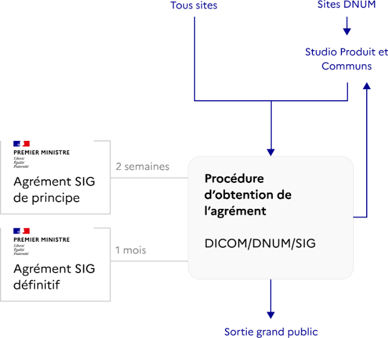

# 🏛️ Procédure d’agrément SIG


Note en cours d'écriture. Le contenu peut être amené à évoluer suite aux retours des chefs de projets et produits numérique. Tout retour est le bienvenu par commentaire direct sur cette page, merci.


## Objectif

L’agrément SIG vise à garantir la **cohérence**, la **qualité** et la **visibilité** des services numériques de l’État.\
Il permet de s’assurer que tout nouveau site ou application :

* respecte le **Système de Design de l’État (DSFR)** et les règles d’accessibilité (RGAA) ;
* s’inscrit dans la **stratégie de communication gouvernementale** pilotée par le SIG ;
* contribue à la **rationalisation des sites publics** et à la **lisibilité de l’action de l’État**.

## Ressources

* [Procédure des agréments](https://www.systeme-de-design.gouv.fr/version-courante/fr/premiers-pas/procedure-des-agrements)
* [DSFR – Documentation officielle](https://www.systeme-de-design.gouv.fr)
* Contact DICOM : [dicom-agrements-sites@sg.social.gouv.fr](mailto:dicom-agrements-sites@sg.social.gouv.fr)

***

## Quand une demande est-elle obligatoire ?

Tout projet de **création** ou de **refonte** de site ou d’application grand public émanant d’un service de l’État doit obtenir un **agrément préalable du SIG** — quelle que soit son URL (.gouv.fr, .fr, etc.).

Sont concernés :

* Les sites institutionnels ou thématiques (ex. : `sante.gouv.fr`, `handicap.gouv.fr`)
* Les sites de démarches ou services en ligne
* Les applications mobiles publiques

Ne sont **pas soumis** à agrément :

* Les outils internes (intranets, extranets, outils métiers)
* Les produits sans diffusion publique

***

## Les acteurs impliqués

<table><thead><tr><th width="195.7734375">Acteur</th><th>Rôle principal</th></tr></thead><tbody><tr><td><strong>SIG</strong></td><td>Délivre les agréments de principe et définitifs pour tous les sites et applications publics de l’État.</td></tr><tr><td><strong>DICOM</strong></td><td>Guichet unique pour les demandes d’agrément SIG. Centralise les dossiers et assure la cohérence de la communication gouvernementale.</td></tr><tr><td><strong>DNUM</strong></td><td>Garantit la conformité technique, la qualité du design et l’accessibilité des services numériques.</td></tr><tr><td><strong>Responsable design</strong></td><td>Veille à l’intégration du DSFR et à la conception centrée usagers.</td></tr><tr><td><strong>Référents DAC</strong></td><td>Assurent la sensibilisation et le suivi des produits de leur direction.</td></tr></tbody></table>

***

<figure><figcaption></figcaption></figure>

## Détail des étapes

### 1. Signalement du projet

Dès la phase de cadrage, contacter :\
📧 **dicom-agrements-sites@sg.social.gouv.fr**

Fournir un **formulaire de cadrage** précisant :

* Domaine concerné (santé, travail, solidarités, etc.)
* Objectifs du produit et profil des utilisateurs
* Type (création/refonte)
* Calendrier et budget prévisionnel
* URL envisagée
* Engagements de conformité (DSFR, RGAA ≥ 80 %, CNIL, etc.)

Une **réunion de coordination** est ensuite organisée entre la DICOM, la DNUM et le responsable design.

***

### 2. Agrément de principe (SIG)

Avant tout lancement de conception :

* La DICOM transmet la demande au SIG.
* Le SIG vérifie la cohérence avec les sites existants et la prise en compte des prérequis de l'agrément définitif.
* Délai moyen d’instruction : **1 à 2 semaines**.

L’agrément de principe peut être :

* ✅ accordé
* ⚠️ accordé sous réserve
* ❌ refusé

***

### 3. Conception et développement

L’équipe produit veille à la conformité du produit avec les exigences de l’État :

* Application du **DSFR**
* Tests utilisateurs
* Audit **RGAA**, **RGPD**, **sécurité**, **hébergement souverain**
* Préparation des éléments de marquage et de mesure d’audience (CNIL conforme)
* Réservation et validation du **nom de domaine** via la DICOM/DNUM

***

### 4. Agrément définitif (SIG)

Demandé **au moins un mois avant la mise à disposition du grand public**, il valide la conformité finale du site.

Points de vérification :

* Audit d’accessibilité RGAA (> 80 %, 100% 6 mois après le lancement)
* Conformité DSFR et marque de l’État
* Outil de mesure d’audience conforme CNIL
* Restitution des tests utilisateurs (≥ 5 personnes testés par profil usager)
* Homologation RGS
* Conformité RGPD

Délai d’instruction : environ **3 à 4 semaines**

L’agrément définitif peut être :

* ✅ accordé
* ⚠️ accordé sous réserve
* ❌ refusé

***

<figure><figcaption></figcaption></figure>

## Cas particuliers

### Noms de domaine et redirections

Toute nouvelle URL ou redirection vers un site en `.gouv.fr` nécessite également un agrément.

### Produits évoluant en agile

Un nouvel agrément doit être demandé en cas d’évolution majeure de l’interface ou du périmètre d’usage.

### Méthode produit et phases de test&#x20;

Dans une logique de fonctionnement itératif propre à la méthode produit, il peut être nécessaire de lancer un service en environnement de test, en pré-production ou en version bêta afin d’évaluer des hypothèses d’usage, de mesurer l’impact des évolutions ou de conduire des tests utilisateurs.&#x20;

Dans ces situations, l'agrément de principe doit être obtenu. L'agrément de principe autorise la mise en ligne contrôlée du service dans un périmètre restreint, sous-domaine ou dispositif expérimental, à condition que :&#x20;

* l’équipe produit s’engage à respecter les exigences minimales de conformité (DSFR, accessibilité, sécurité, marque de l’État) nécessaires à une exposition publique même limitée ;&#x20;
* le périmètre de l’expérimentation, la durée et les modalités d’accès soient clairement définis ;&#x20;
* les retours utilisateurs recueillis pendant cette phase soient utilisés pour itérer en vue de l’agrément définitif.&#x20;

L’agrément définitif reste obligatoire avant une mise en production générale ou une ouverture grand public.&#x20;

***

## Suivi et accompagnement

Un suivi des projets agréés est assuré conjointement par la DICOM et la DNUM :\
→ pour évaluer les délais, les difficultés et la conformité des projets ;\
→ pour partager les mises à jour de la procédure.
