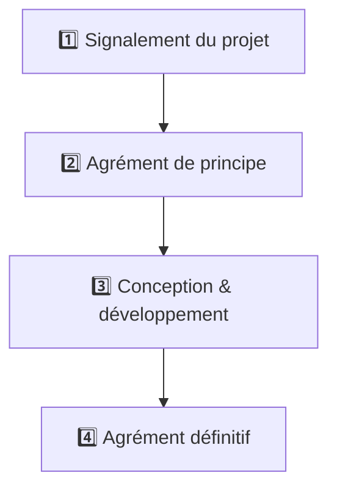

# 🏛️ Procédure d’agrément SIG

> Cette page présente de façon synthétique la procédure d’agrément du **Service d’Information du Gouvernement (SIG)** applicable à toute **création ou refonte de site internet ou d’application mobile** au sein des ministères sociaux.

---

## 🎯 Objectif

L’agrément SIG vise à garantir la **cohérence**, la **qualité** et la **visibilité** des services numériques de l’État.  
Il permet de s’assurer que tout nouveau site ou application :

- respecte le **Système de Design de l’État (DSFR)** et les règles d’accessibilité (RGAA) ;
- s’inscrit dans la **stratégie de communication gouvernementale** pilotée par le SIG ;
- contribue à la **rationalisation des sites publics** et à la **lisibilité de l’action de l’État**.

---

## 🧭 Quand une demande est-elle obligatoire ?

Tout projet de **création** ou de **refonte majeure** de site ou d’application grand public émanant d’un service de l’État doit obtenir un **agrément préalable du SIG** — quelle que soit son URL (.gouv.fr, .fr, etc.).

Sont concernés :

- Les sites institutionnels ou thématiques (ex. : `sante.gouv.fr`, `handicap.gouv.fr`)  
- Les sites de démarches ou services en ligne  
- Les applications mobiles publiques  

Ne sont **pas soumis** à agrément :

- Les outils internes (intranets, extranets, outils métiers)  
- Les projets sans diffusion publique  

---

## 👥 Les acteurs impliqués

| Acteur | Rôle principal |
|--------|----------------|
| **DICOM** | Guichet unique pour les demandes d’agrément SIG. Centralise les dossiers et assure la cohérence de la communication gouvernementale. |
| **DNUM** | Garantit la conformité technique, la qualité du design et l’accessibilité des services numériques. |
| **Responsable design** | Veille à l’intégration du DSFR et à la conception centrée usagers. |
| **SIG** | Délivre les agréments de principe et définitifs pour tous les sites et applications publics de l’État. |
| **Référents DAC** | Assurent la sensibilisation et le suivi des projets de leur direction. |

---

## ⚙️ La procédure en 4 étapes — schéma global

```mermaid
flowchart TD
    A[Début du projet] --> B[📩 Signalement à la DICOM<br/>avec formulaire de cadrage]
    B --> C[🤝 Réunion de coordination<br/>DICOM · DNUM · Responsable design]
    C --> D[📜 Demande d’agrément de principe<br/>transmise par la DICOM au SIG]
    D --> E{SIG}
    E -->|✅ Accord| F[🚀 Lancement conception et développement<br/>Application DSFR, RGAA, tests usagers, sécurité]
    E -->|⚠️ Sous réserve| F
    E -->|❌ Refus| G[Reformulation du besoin / mutualisation possible]
    F --> H[📑 Demande d’agrément définitif<br/>avant mise en ligne]
    H --> I{SIG vérifie conformité<br/>(DSFR, RGAA, .gouv.fr, CNIL...)]
    I -->|✅ Agrément accordé| J[🌐 Mise en ligne du site ou de l’application]
    I -->|❌ Réserves| K[🔁 Corrections demandées<br/>puis revalidation]
    J --> L[📊 Suivi et retour d’expérience<br/>DICOM + DNUM]
```

---

## 🗺️ Schéma linéaire (timeline verticale)



Ce schéma présente de façon **linéaire** et **simplifiée** les quatre grandes étapes de la procédure ; il peut être particulièrement lisible sur mobile ou dans une export PDF GitBook.

---

## 🪜 Détail des étapes

### 1️⃣ Signalement du projet

Dès la phase de cadrage, contacter :  
📧 **dicom-agrements-sites@sg.social.gouv.fr**

➡️ Fournir un **formulaire de cadrage** précisant :

- Domaine concerné (santé, travail, solidarités, etc.)  
- Objectifs du projet et profil des utilisateurs  
- Type de projet (création/refonte)  
- Calendrier et budget prévisionnel  
- URL envisagée  
- Engagements de conformité (DSFR, RGAA ≥ 75 %, CNIL, etc.)

Une **réunion de coordination** est ensuite organisée entre la DICOM, la DNUM et le responsable design.

---

### 2️⃣ Agrément de principe (SIG)

Avant tout lancement de conception :

- La DICOM transmet la demande au SIG.  
- Le SIG vérifie la cohérence avec les sites existants et la conformité des prérequis (DSFR, RGAA, RGPD, etc.).  
- Délai moyen d’instruction : **3 à 4 semaines**.

L’agrément peut être :

- ✅ accordé  
- ⚠️ accordé sous réserve  
- ❌ refusé

---

### 3️⃣ Conception et développement

L’équipe projet veille à la conformité du produit avec les exigences de l’État :

- Application du **DSFR**  
- Tests utilisateurs  
- Audit **RGAA**, **RGPD**, **sécurité**, **hébergement souverain**  
- Préparation des éléments de marquage et de mesure d’audience (CNIL conforme)  
- Réservation et validation du **nom de domaine** via la DICOM/DNUM  

---

### 4️⃣ Agrément définitif (SIG)

Demandé **au moins un mois avant la mise en ligne**, il valide la conformité finale du site.

Points de vérification :

- Audit d’accessibilité (> 75 %)  
- Conformité DSFR et marque de l’État  
- Outil de mesure d’audience conforme CNIL  
- Utilisation du **.gouv.fr**  
- Restitution des tests utilisateurs (≥ 5 profils testés)

📅 Délai d’instruction : environ **3 à 4 semaines**

---

## 🧩 Cas particuliers

### 🔀 Noms de domaine et redirections

Toute nouvelle URL ou redirection vers un site en `.gouv.fr` nécessite également un agrément.

### 🔁 Produits évoluant en agile

Un nouvel agrément doit être demandé en cas d’évolution majeure de l’interface ou du périmètre d’usage.

---

## 🤝 Rôle des référents DAC

Chaque direction d’administration centrale désigne un **référent agrément** chargé de :

- relayer la procédure au sein de sa direction ;  
- centraliser les projets ;  
- assurer le lien avec la DICOM et la DNUM.  

---

## 📊 Suivi et accompagnement

Un **suivi des projets agréés** est assuré conjointement par la DICOM et la DNUM :  
→ pour évaluer les délais, les difficultés et la conformité des projets ;  
→ pour partager les mises à jour de la procédure et organiser une réunion annuelle avec les référents DAC.

---

## 📚 Ressources

- [Circulaire n° 6411/SG du 7 juillet 2023 – Système de Design de l’État](https://www.systeme-de-design.gouv.fr)  
- [DSFR – Documentation officielle](https://www.systeme-de-design.gouv.fr)  
- [Contact DICOM : dicom-agrements-sites@sg.social.gouv.fr](mailto:dicom-agrements-sites@sg.social.gouv.fr)  

---

_Mis à jour par la DNUM – version publiée après signature officielle de la note d’agrément SIG._
