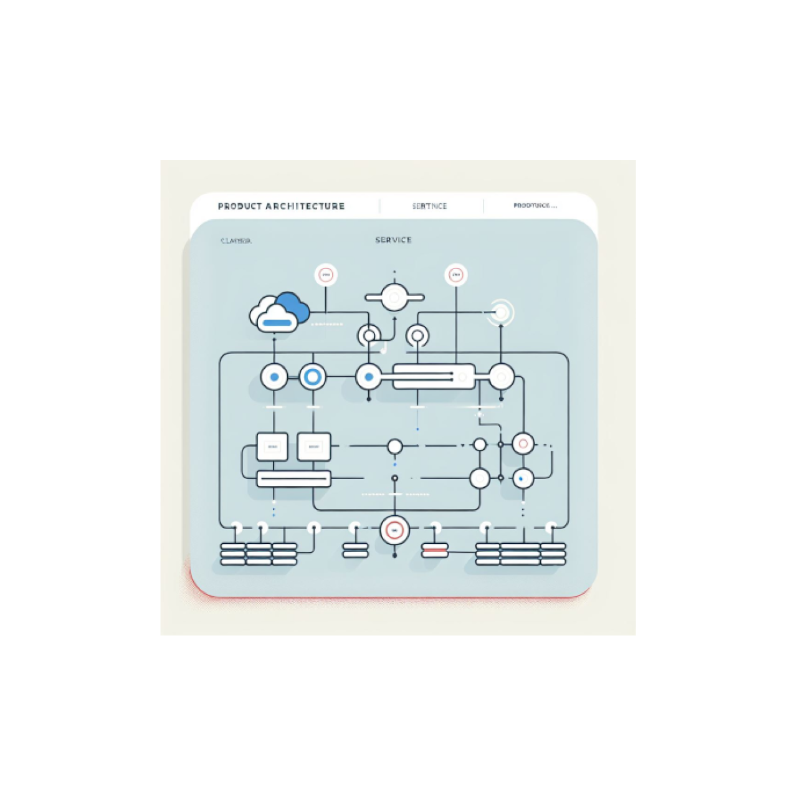

# Accompagnement pour définir l'architecture

<figure><figcaption></figcaption></figure>

Vous avez besoin d'aide pour définir l'architecture de votre produit ?

Faites appel à nos architectes pour :

* Le choix de solutions d'authentification (agents, grand public, établissements de santé, etc.), de gestion documentaire, de choix d'hébergement, etc.
* La co-construction de l'architecture avec l'équipe produit.

_<mark style="color:red;">#ARCHI #SOLUTION</mark>_

***

* **Délai d'intervention :** 1 mois
* **Durée d'intervention :** 5 à 20 jours selon complexité de votre contexte ; reconductibles
* **Cycle de vie du produit :** Exploration, conception, amélioration

**Livrables :**

* Des recommandations ou prescriptions adaptées à votre contexte.
* Contributions à votre document d'architecture.
* Support **ponctuel** lors de la mise en œuvre.

**Conditions de réussite :**

* Embarquement réalisé par l'équipe produit : présentation du contexte, des attentes, des enjeux.
* Collaboration entre nos architectes et les parties prenantes : équipe produit, prestataires, métier, utilisateurs.
* Selon la durée d'intervention, un suivi régulier entre vous et le responsable technologie ou responsable du bureau D\&D : partage des risques, ajustement des ressources.
* Selon la durée de l'intervention : un financement nécessaire.

**Ce que nous ne faisons pas :**

* Prendre des décisions suite à nos recommandations : nous fournissons les clés, vous prenez la décision.
* Se substituer à l'architecte de votre TMA.
* Rédiger votre DA (responsabilité de votre TMA) ou le valider (responsabilité du COAT).
  * Nous y contribuons volontiers 👍
