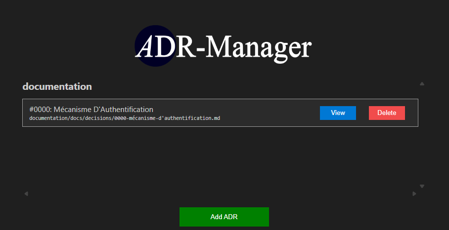

# Fiche de Décision d'Architecture (ADR)
Une **Fiche de Décision d’Architecture** (*Architecture Decision Record – ADR*) documente une décision d’architecture importante, en précisant le **contexte**, la **décision prise** et ses **conséquences**.  
Elle permet de garder une trace claire des choix techniques et d’assurer leur compréhension dans le temps.

## Pourquoi utiliser une ADR ?

Les ADR servent à :
- Justifier les décisions structurantes.
- Favoriser la transparence et la traçabilité.
- Faciliter l’onboarding et le partage de la connaissance.
- Documenter les évolutions ou révisions d’architecture.

### Choix du modèle ?
👉 Plusieurs modèles sont proposés. Voir [modèles ADR](https://github.com/joelparkerhenderson/architecture-decision-record/tree/main/locales/en/templates "modèles ADR").

👉 Plusieurs modèles existent et plusieurs sont disponibles
[ici](https://github.com/joelparkerhenderson/architecture-decision-record/tree/main/locales/en/templates).

## Notre modèle : celui proposé par Michael Nygard

**Titre**  
Donnez un titre explicite à la décision.  

**Statut**  
Indiquez le **statut** actuel de la décision (voir section [Signification des statuts](#signification-des-statuts)).

**Contexte**  
Décrivez le problème ou le contexte qui motive cette décision ou ce changement.  

**Décision**  
Décrivez la décision prise ou le changement effectué.  

**Conséquences**  
Décrivez les impacts de cette décision.

## Signification des statuts

Le **statut** reflète la vie de la décision dans le temps.  
Il doit être mis à jour dès qu’une nouvelle information modifie la validité de l’ADR.

| Statut | Signification |  
|---------|----------------|  
| **Proposé** | La décision est en cours de discussion, non encore validée. |  
| **Accepté** | La décision a été validée et est appliquée ou en cours d’application. |  
| **Rejeté** | La décision a été étudiée mais n’a pas été retenue. |  
| **Déprécié** | La décision reste **valide historiquement**, mais **ne doit plus être utilisée pour de nouveaux projets**. Elle est amenée à disparaître à terme. |  
| **Remplacé** | La décision a été **explicitement remplacée** par une autre ADR plus récente. La nouvelle ADR doit être référencée. |  

## Organisation des ADRs

Pour assurer une gestion efficace des Fiches de Décision d'Architecture, nous recommandons :

- **Stockage centralisé** : Conserver tous les ADR dans un répertoire dédié du projet (ex. `/docs/adr/`).
- **Nomination cohérente** : Utiliser un format de nommage standard, tel que `adr-<numéro>-<titre>.md`.
- **Historisation** : Maintenir un historique des décisions pour faciliter le suivi des évolutions.
- **Référencement croisé** : Lier les ADR entre elles lorsque des décisions sont dépendantes ou liées.
- **Suivi périodique** : Planifier des suivis réguliers pour échanger sur les décisions prises, en cours ou à prendre.
- **Accessibilité** : S'assurer que les ADRs sont facilement accessibles à toutes les parties prenantes du projet.

## Outils

- **VS Code ADR Extension** :
  [Extension pour Visual Studio Code](https://marketplace.visualstudio.com/items?itemName=StevenChen.vscode-adr-manager)
  facilitant la création et la gestion des ADR directement depuis l’éditeur.
    
