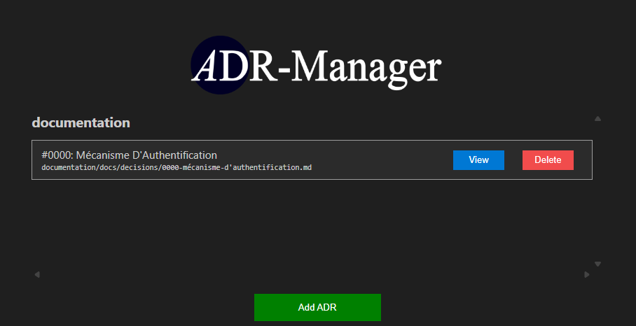

# 🗒️ Architecture Decision Records

Une Fiche de Décision d'Architecture est un document qui capture une décision d'architecture importante. Cette fiche contient le contexte et les conséquences de cette décision.

## Choix du modèle ?

👉 Plusieurs modèles existent et plusieurs sont disponibles [ici](https://github.com/joelparkerhenderson/architecture-decision-record/tree/main/locales/en/templates).

## Notre modèle : celui proposé par Michael Nygard

**Titre**\
Description du titre de la décision.

**Statut**\
Le statut : brouillon, proposé, accepté, rejeté, remplacé.

**Contexte**\
Le problème ou le contexte qui motive cette décision ou ce changement.

**Décision**\
La décision ou le changement proposé/réalisé.

**Conséquences**\
Ce qui devient plus facile ou plus difficile avec ce changement.

### Déprécié ou remplacé ?

Dans la même mesure que nous ne devons pas récrire l'histoire, **nous ne pouvons pas modifier des ADRs acceptées**.

Si une décision prise n'est plus pertinente parce que (non-exhaustif) :

* L'organisation a choisi une direction différente
  * Exemple : passage d'un hébergement on-premise vers du cloud
* Le produit a évolué
  * Exemple : fonctionnalité retirée du produit
* L'équipe rencontre un besoin motivant un changement de paradigme
  * Exemple : stockage objet dans un S3 plutôt que dans une base de données relationnelle

Nous déclarons alors que la décision est **dépréciée** et un **ADR remplaçant cette décision** est alors créé.

Le nouvel ADR a alors pour objectif de :

* Décrire le contexte motivant la dépréciation de l'ADR précédent
  * Ce qui a changé entre temps
* Expliciter les conséquences techniques, produit, voire organisationnelles
  * Exemple : définition d'un nouveau choix par défaut (cloud) et d'un choix alternatif (on-premise)
* Lister les autres options considérées, si besoin

## Organisation des ADRs

Pour assurer une gestion efficace des Fiches de Décision d'Architecture, nous recommandons :

* **Stockage centralisé** : Conserver tous les ADR dans un répertoire dédié du projet (ex. `/docs/adr/`).
* **Nomination cohérente** : Utiliser un format de nommage standard, tel que `adr-<numéro>-<titre>.md`.
* **Historisation** : Maintenir un historique des décisions pour faciliter le suivi des évolutions.
* **Référencement croisé** : Lier les ADR entre elles lorsque des décisions sont dépendantes ou liées.
* **Suivi périodique** : Planifier des suivis réguliers pour échanger sur les décisions prises, en cours ou à prendre.
* **Accessibilité** : S'assurer que les ADRs sont facilement accessibles à toutes les parties prenantes du projet.

## Outils

* **VS Code ADR Extension** : [Extension pour Visual Studio Code](https://marketplace.visualstudio.com/items?itemName=StevenChen.vscode-adr-manager) facilitant la création et la gestion des ADR directement depuis l’éditeur. 
