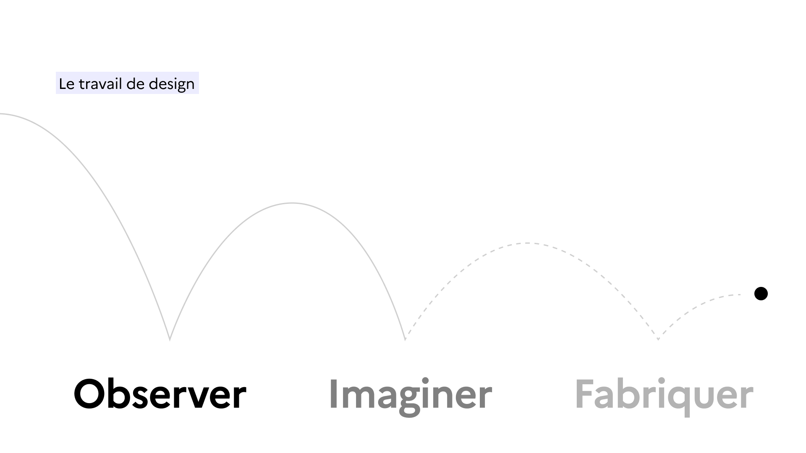
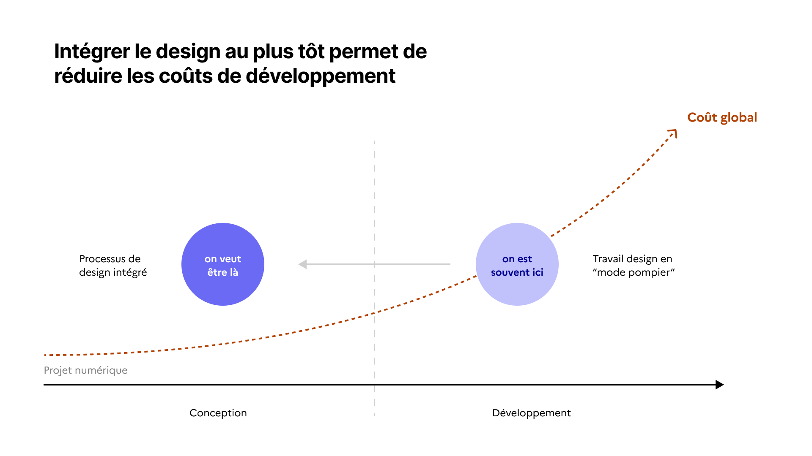

# Engager un processus de design

## Pourquoi faire du design ?

Le design est une approche clé pour garantir des services publics numériques accessibles, simples et efficaces. Grâce au design, nous rencontrons nos utilisateurs finaux, comprenons leurs besoins et attentes puis testons sur maquette ou prototype les solutions avant le lancement des développements.

<figure><figcaption></figcaption></figure>

Le design nous aide à :

* mettre nos usagers au coeur de votre conception et de votre équipe
* construire des produits dans lesquels nos usagers ont confiance
* réduire nos coûts de développements en priorisant les besoins réels de nos usagers
* réduire nos besoins en formation, support, guide d'utilisation, amélioration continue

Toute refonte ou évolution fonctionnelle majeure doit inclure un processus de design et notamment la partie recherche utilisateur.

<figure><figcaption></figcaption></figure>

### Comment faire du design ?

En intégrant un designer et expert en recherche utilisateur au plus tôt. Ces experts nous accompagnent sur les grandes tâches suivantes :

* Recherche utilisateur : Entretiens avec les utilisateurs réels pour comprendre leurs attentes et les difficultés rencontrées dans leur usage.
* Tests et avis utilisateurs réguliers : Menés à chaque étape pour valider des hypothèses de parcours, ajuster les interfaces et s’assurer qu’elles restent accessibles à tous (incluant des tests spécifiques pour les utilisateurs en situation de handicap).
* Prototypage : Conception de maquettes interactives testées en amont par les utilisateurs pour obtenir des retours rapides avant le développement.
* Collaboration étendue : Travail en amont et en aval avec les différents partenaires (métier, produit, accessibilité, développement) pour évaluer les hypothèses, les fonctionnalités, le niveau d'effort de développement.

***

### Quand engager un processus de design ?

Il est recommandé d'engager un processus de design si le produit a :

* **100 usagers particuliers ou plus**
  Utilisateurs qui cherchent des services administratifs (allocations, déclarations, informations). Une attention particulière est apportée aux utilisateurs des [250 démarches essentielles](https://observatoire.numerique.gouv.fr/).
* **100 usagers professionnels ou plus**\
  Incluent des experts comme des responsables d'établissement, des professionnels de santé qui utilisent les services dans le cadre de leur métier. Ils ont besoin d’outils efficaces et qui ne nécessitent aucune formation.
* **10 agents publics**\
  Agents d'ARS, de DDETS, de DREETs ou autres qui utilisent des outils internes pour exécuter leurs missions. Leurs attentes sont orientées vers la performance, la simplicité et un besoin en formation minimal.
* **10 partenaires métiers**\
  Profils spécifiques au sein des ministères (juristes, pilotes de politique public, etc.) ou des collectivités locale (Directions Départementales, Directions Régionales) avec des besoins parfois complexes ou inédits.

Le processus de design sera adapté à votre réalité et à votre besoin, il a pour priorité de d'aider à rencontrer nos utilisateurs.&#x20;


Ressources utiles :

* Qu'est-ce que le design, [formation sur mentor.gouv](https://www.modernisation.gouv.fr/campus-de-la-transformation-publique/catalogue-de-ressources/formation/quest-ce-que-le-design) (30 min)
* Formation design, [vidéo de la DINUM](https://www.youtube.com/live/QjGzdw4OSO8?si=ZBTpDIr-c0YeqRHV) (2 h)
* Bien faire du numérique public, [vidéo de la DINUM](https://www.youtube.com/live/7Z9_YLcynXw) (2h)

