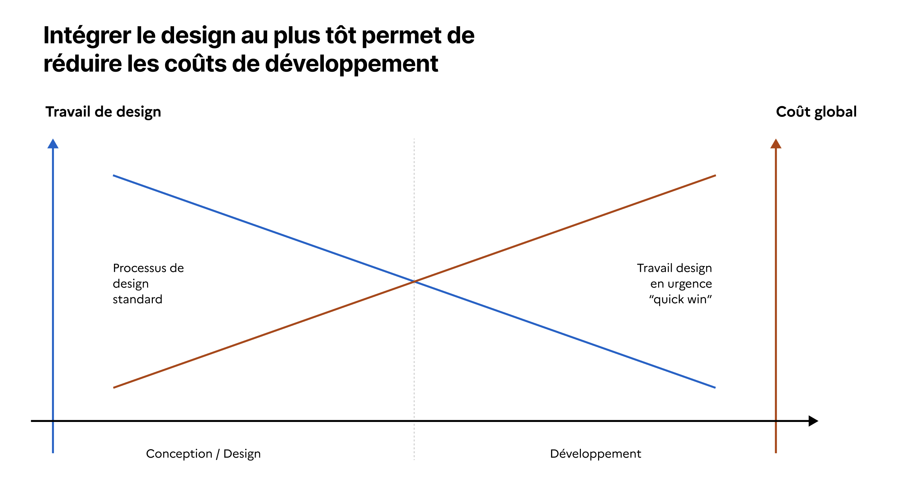

---
layout:
  title:
    visible: true
  description:
    visible: true
  tableOfContents:
    visible: true
  outline:
    visible: true
  pagination:
    visible: false
---

# Engager un processus de design

## Processus de Design

Le design numérique est une approche clé pour garantir des services publics numériques accessibles, simples et efficaces. Le processus de design est collaboratif et itératif. Il amène à rencontrer les utilisateurs réels, à comprendre leurs besoins et attentes puis à tester sur maquette ou prototype les solutions avant le lancement des développements.

Toute refonte ou évolution fonctionnelle majeure doit inclure un processus de design et notamment la partie recherche utilisateur.

### Nos utilisateurs

Nous concevons pour les utilisateurs suivants :

* Usagers particuliers (citoyens) : Cherchent des services administratifs (allocations, déclarations, informations) et ont besoin d’une navigation simple, claire et inclusive.
* Usagers professionnels : Incluent des experts comme des responsables d'établissement, des professionnels de santé qui utilisent les services dans le cadre de leur métier. Ils ont besoin d’outils efficaces et qui nécessitent aucune formation.
* Agents publics : Agents d'ARS ou de DREETs qui utilisent des outils internes pour exécuter leurs missions. Leurs attentes sont orientées vers la performance, la simplicité et un besoin en formation minimal.
* Partenaires métier : Profils spécifiques au sein des ministères (juristes, pilotes de politique public, etc.) ou des collectivités locale (Directions Départementales, Directions Régionales) avec des besoins parfois complexes ou\
  inédits.

<figure><figcaption></figcaption></figure>

### Méthodologie de conception

La conception des nouveaux produits numériques est réalisée en collaboration avec les utilisateurs, agents, les partenaires mais aussi les prestataires. La conception doit inclure notamment :

* Recherche utilisateur : Entretiens avec les utilisateurs réels pour comprendre leurs attentes et les difficultés rencontrées dans leur usage.
* Tests et avis utilisateurs réguliers : Menés à chaque étape pour valider des hypothèses de parcours, ajuster les interfaces et s’assurer qu’elles restent accessibles à tous (incluant des tests spécifiques pour les utilisateurs en situation de handicap).
* Prototypage : Conception de maquettes interactives testées en amont par les utilisateurs pour obtenir des retours rapides avant le développement.
* Collaboration étendue : Travail en amont et en aval avec les différents partenaires (métier, produit, accessibilité, développement) pour évaluer les hypothèses, les fonctionnalités, le niveau d'effort de développement.

###


Ressources utiles :&#x20;

* Qu'est-ce que le design, [formation sur mentor.gouv](https://www.modernisation.gouv.fr/campus-de-la-transformation-publique/catalogue-de-ressources/formation/quest-ce-que-le-design) (30 min)
* Formation design, [vidéo de la DINUM](https://www.youtube.com/live/QjGzdw4OSO8?si=ZBTpDIr-c0YeqRHV) (2 h)
* Bien faire du numérique public, [vidéo de la DINUM](https://www.youtube.com/live/7Z9_YLcynXw) (2h)


