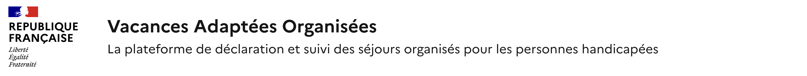

# Représenter son produit dans les en-têtes des sites

Tout site porté par l’Etat et ses opérateurs doit respecter les règles d’usage de la marque Etat. Dans le cas des sites soumis à agrément du SIG, le non-respect des règles d’usage entrainera le refus d’agrément.

Ces règles permettent de garantir une meilleure lisibilité pour les usagers et de renforcer la confiance dans nos services en ligne.

<figure><figcaption></figcaption></figure>

<mark style="color:$info;">Exemple d'un bloc-marque ministériel avec le nom du produit en titre et sa baseline</mark>

Ressources utiles : &#x20;

* [L'architecture de marque de l’État.](https://www.info.gouv.fr/marque-de-letat/l-architecture-de-marque-de-l-etat)&#x20;
* [Circulaire 6411-SG du 7 juillet 2023](https://www.systeme-de-design.gouv.fr/version-courante/fr/premiers-pas/perimetre-d-application)&#x20;
* [Jaune budgétaire 2025 (section "accès rapide" en bas de page)](https://www.budget.gouv.fr/documentation/documents-budgetaires/exercice-2025/projet-loi-finances-les/jaunes-budgetaires-2025-plf-2025) &#x20;
* [Modèles d'en-têtes à utiliser (maquettes Figma)](https://www.figma.com/design/1F77YLcBVbNw4CCEUr9PSQ/Mod%C3%A8les-de-pages-et-standards-d-espacements?node-id=4355-3259\&p=f\&t=6AiqhwsDt4COtXlj-11)

***

Il faut distinguer 3 types de site : &#x20;

* **Sites des Ministères, secrétariats d’État, services déconcentrés ou à l’étranger :** sites vitrines, sites web externes ou internes associés à ces entités. Exemples : sante.gouv.fr, travail-emploi.gouv.fr, [www.egalite-femmes-hommes.gouv.fr](https://www.egalite-femmes-hommes.gouv.fr/).&#x20;
* **Sites d’opérateurs :** sites d’établissements publics inscrits au jaune budgétaire de l’année en cours. Exemple d’opérateurs : ARS, INSERM, France Travail. &#x20;
* **Sites serviciels :** sites d’entités ayant un point de contact physique avec le public, et/ou une expérience servicielle individuelle en ligne nécessitant par exemple un système de login/mot de passe. Ces sites doivent rendre un service direct à l’usager, proposer un accueil du public ou bénéficier d’une très forte notoriété. Exemples : [honorabilite.social.gouv.fr,](https://honorabilite.social.gouv.fr/) egapro.travail.gouv.fr, sante.fr.&#x20;
  * Sont exclus : &#x20;
    * les sites purement informatifs,&#x20;
    * les entités ne disposant pas de service direct à l’usager.&#x20;


Si vous ne savez pas dans quelle catégorie votre site se situe, contactez votre DICOM et le responsable design avant toute décision.


***

### Comment représenter mon produit dans l'en-tête de mon site ?

<table data-header-hidden><thead><tr><th width="141.859375">Type de site </th><th>Bloc-marque </th><th>Logo possible ? </th><th>Exemple </th></tr></thead><tbody><tr><td>Type de site</td><td>Bloc-marque</td><td>Logo possible ?</td><td>Exemple</td></tr><tr><td>Ministère </td><td>Ministériel </td><td>❌ Non </td><td>sante.gouv.fr </td></tr><tr><td>Opérateur </td><td>RF ou Ministériel </td><td>✅ Oui </td><td>ARS IDF </td></tr><tr><td>Serviciel </td><td>RF ou Ministériel </td><td>✅ Oui (après validation DICOM/DNUM) </td><td>egapro.travail.gouv.fr </td></tr></tbody></table>

<figure><figcaption></figcaption></figure>

<mark style="color:$info;">Représentation des droits d'utilisation des bloc-marques et logo en fonction des entités émettrices</mark>

#### Pour les sites ministériels&#x20;

Le bloc-marque du ministère est obligatoire. Si plusieurs ministères portent le site/produit, utiliser le bloc-marque Gouvernement.&#x20;

⚠️ L’utilisation d’un logotype et/ou du bloc-marque République Française ne sont pas autorisés. L’agrément SIG, si nécessaire, sera refusé.&#x20;

Que faire si un site ministériel a déjà un logo ? En cas de refonte ou d’évolution, le logo devra être retiré lors d’une prochaine mise en production. &#x20;

<figure><figcaption></figcaption></figure>

<mark style="color:$info;">Bloc-marque MTSSF</mark>

 

<mark style="color:$info;">Bloc-marque gouvernement</mark>

<figure><figcaption></figcaption></figure>

<mark style="color:$info;">Exemple d'en-tête de site ministériel</mark>

&#x20;

#### Pour les opérateurs de l'Etat&#x20;

Les opérateurs inscrits au jaune budgétaire ont la possibilité d’afficher leur logotype à côté du bloc-marque République Française. Par ailleurs, les opérateurs qui souhaitent afficher un attachement avec leur ministère peuvent utiliser le bloc-marque du ministère et le nom de leur site en HTML.&#x20;

⚠️ L’utilisation d’un logotype n’est pas possible avec le bloc-marque du ministère.&#x20;

  

<mark style="color:$info;">Exemple d'en-têtes d'opérateurs, sites de l'ARS Ile de France et de France Travail</mark> 

#### Pour les entités servicielles&#x20;

Les entités rendant un service à l’usager peuvent afficher un logotype à côté du bloc-marque République Française, ce n’est pas une obligation. Ces entités peuvent choisir d’utiliser le bloc-marque du ministère et le nom de leur site et description du site en Html.&#x20;

Pour les nouveaux logos : l’utilisation d’un logotype est soumise à approbation au cas par cas par arbitrage DICOM/DNUM-SIG afin de limiter l’inflation d’identités graphiques auxquelles sont exposés les citoyens.&#x20;


Dans le doute, demandez à votre DICOM et responsable du design avant d’engager la création d’un logo. &#x20;


&#x20; &#x20;

<figure><figcaption></figcaption></figure>

 <mark style="color:$info;">Exemple d'en-tête de site serviciel sans logo avec le bloc-marque ministériel, le nom du site et sa description</mark>

<figure><figcaption></figcaption></figure>

<mark style="color:$info;">Exemple d'en-tête de site serviciel avec le bloc-marque République Française, le nom du site et sa description</mark>

