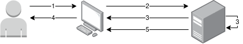
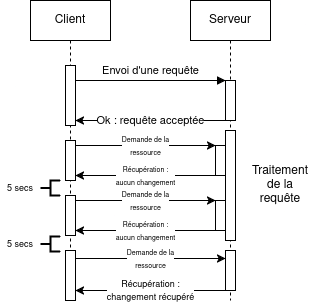
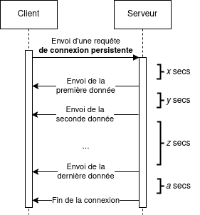
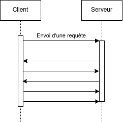
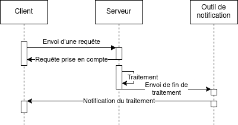

# ⌛ Traitements asynchrones

Cette page documente diverses solutions possibles lorsqu'un processus asynchrone est considéré.

1. [Cas d'utilisation](processus-asynchrones.md#cas-dutilisation)
2. [Différences avec un processus synchrone](processus-asynchrones.md#différences-avec-un-processus-synchrone)
3. [Avantages et inconvénients](processus-asynchrones.md#avantages-et-inconvénients)
4. [Quels moyens de récupérer une information](processus-asynchrones.md#quels-moyens-de-récupérer-une-information)
5. [Considérations non-techniques](processus-asynchrones.md#considérations-non-techniques)

***

## Cas d'utilisation

Un fonctionnement asynchrone peut être pertinent dans certains cas typiques :

* Une tâche prend au moins 10 secondes pour se terminer, ou nous ne savons pas sous combien de temps elle peut aboutir.
* Nous faisons appel à des systèmes tierces qui ont un temps de réponse élevé, ou indéfini.
* Des systèmes tierces ont eux-mêmes un fonctionnement asynchrone et nous devons avoir un fonctionnement compatible pour s'intégrer avec eux.

Néanmoins :

* **S'il est possible de ne pas avoir de processus asynchrone, il est préférable de s'en passer.**
* Si un processus asynchrone doit être conçu dans une application existante parce que cela ne peut pas être évité, il est fortement recommandé d'utiliser la solution de moindre coût : le [polling](processus-asynchrones.md#requêtes-à-intervalles-réguliers-ou-polling).

## Différences avec un processus synchrone

Dans le cas d'un processus synchrone, lorsqu'un utilisateur envoie une requête via l'interface, sa réponse arrive lorsque le serveur a terminé de la traiter.

<figure><figcaption>
Traitement synchrone
</figcaption></figure>

1. L'utilisateur exécute une action sur l'interface,
2. Une requête est envoyée au serveur,
3. Le serveur la traite,
4. Le serveur renvoie une réponse,
5. L'utilisateur peut continuer à utiliser l'application.

En revanche, dans le cas d'un processus asynchrone, le serveur répond qu'il a tenu compte de la requête lors de sa réception. Cela lui permet de la traiter à un moment opportun et surtout de redonner immédiatement la main à l'utilisateur, pour utiliser l'application.

<figure><figcaption>
Traitement asynchrone
</figcaption></figure>

1. L'utilisateur exécute une action sur l'interface,
2. Une requête est envoyée au serveur,
3. **Le serveur confirme immédiatement à l'utilisateur que sa requête va être traitée**, avant même de la traiter. Il "rend la main" à l'utilisateur,
4. **L'utilisateur peut continuer à utiliser l'application**, même si le résultat de l'action n'est pas encore disponible,
5. **Le résultat de l'action est disponible ultérieurement**, lorsque le serveur termine de traiter la requête. Comme indiqué [plus bas](processus-asynchrones.md#quels-moyens-de-récupérer-une-information), le résultat peut être envoyé à l'utilisateur dans un temps indéfini.

## Avantages et inconvénients

### Avantages

* **Non-bloquant pour l'utilisateur** : le temps d'attente limité rassure, et évite la frustration et le doute.
* **Gain de productivité éventuel** pour l'utilisateur, qui peut continuer à utiliser l'application. Cela ne vaut que si l'action asynchrone n'est pas bloquante pour son travail (import de fichiers, attente de réponse d'un fournisseur tierce, etc.)
* **Performance globale supérieure** : parallélisation possible des tâches côté serveur, traitement à un moment de faible charge pour privilégier les interactions utilisateurs.

### Inconvénients

* **Moindre fraîcheur des données** : le temps de traitement n'étant pas complètement prévisible, il se peut que les données en sortie du traitement asynchrone ne soient pas les plus à jour.
* **Récupération des données / du résultat** : dans le cas d'un processus asynchrone, il faut prévoir un [mécanisme de récupération](processus-asynchrones.md#quels-moyens-de-récupérer-une-information) supplémentaire, qui peut impacter l'expérience utilisateur, la complexité technique de l'application, et son coût de développement.
* **Gestion des erreurs plus complexe** : il faut se poser les questions suivantes lors du design : Comment notifier qu'un traitement a échoué ? Faut-il permettre la reprise du processus ?

## Quels moyens de récupérer une information

### Requêtes à intervalles réguliers, ou "polling"

Le principe de ce moyen est de faire une requête à intervalles réguliers au serveur afin de récupérer les dernières informations.

<figure><figcaption>
Schéma polling
</figcaption></figure>

Pour un intervalle de 5 secondes :

* Le client effectue une requête,
* Le serveur répond qu'elle a été prise en compte,
* Le serveur la traite,
* Le client effectue toutes les 5 secondes une requête pour vérifier la présence du résultat,
* Si le résultat n'est pas prêt, le client effectue un nouvel essai 5 secondes plus tard,
* Si le résultat est disponible, le client peut arrêter de re-demander et traite l'information.

Si la ressource est mise à jour par une autre source, alors le polling peut continuer pour récupérer la donnée la plus à jour, jusqu'à quitter la page.

Les avantages de cette manière sont que ce n'est pas coûteux et facile à implémenter.

En revanche, si l'information n'est pas disponible rapidement, le client va lancer un certain nombre de requêtes afin d'obtenir ce qu'il veut. De plus, l'utilisateur doit garder son application ouverte pour récupérer l'information. Enfin, cette application doit avoir au moins 2 points d'entrées : l'un pour lancer un traitement, et un autre pour récupérer les autres informations.

### Connexion persistante unidirectionnelle, ou "Server-sent events (SSE)"

Les SSE sont un moyen de transmettre de l'information en flux (ou "stream"). C'est particulièrement utile si on veut récupérer des informations au fil de l'eau.

<figure><figcaption>
Schéma SSE
</figcaption></figure>

* Le client effectue une requête et ouvre ainsi une connexion persistante,
* Le serveur en recevant la connexion envoie des données au fil de l'eau, à intervalles potentiellement indéfinis,
* Une fois que le serveur n'a plus rien à envoyer, il envoie une dernière information au client : la fin de la connexion.

Les avantages sont multiples ici : on n'a qu'une connexion ouverte entre le client et le serveur, les informations arrivent au fil de l'eau (c'est particulièrement utile si on possède plusieurs sources de données, à des délais de réponses variés) et c'est le serveur qui termine la connexion.

En revanche, garder cette connexion ouverte a un prix : cela peut paraître acceptable pour un nombre restreint de clients, mais plus on augmente le nombre de connexions plus les ressources mobilisées côté serveur augmentent. De plus, certains outils ou frameworks peuvent ne pas supporter ce mode de communication : il faut donc vérifier cela et tester, car l'infrastructure requise pour ce genre de pattern peut être coûteuse à mettre en place. Enfin, c'est un mode de communication unidirectionnel : le serveur est le seul à pouvoir envoyer des informations.

### Connexion persistante bidirectionnelle, ou "Websockets"

Similairement aux SSE, les connexions bidirectionnelles permettent d'envoyer et de recevoir des informations au fil de l'eau.

<figure><figcaption>
Schéma websockets
</figcaption></figure>

L'avantage principal est la bidirectionnalité des échanges. En revanche, les désavantages sont les mêmes, si ce n'est qu'ils sont accentués : le coût de maintien des connexions ouvertes est plus lourd ici, souvent des bibliothèques logicielles spécifiques sont nécessaires pour supporter les websockets, ou passer par un prestataire externe qui permet d'abstraire cela.

### Notification push

À la différence des modes de communication précédents, les notifications "push" (car le serveur pousse les événements au lieu que le client les tire du serveur) sont un mode de communication où l'asynchronisme est au centre de l'architecture.

À noter que le schéma suivant est très simplifié, et souvent d'autres briques techniques peuvent apparaître (file de message, base de données, etc.)

<figure><figcaption>
Schéma push
</figcaption></figure>

* Le client envoie une requête au serveur,
* Le serveur répond qu'elle a été prise en compte pour rendre la main à l'utilisateur,
* Le serveur la traîte à un moment opportun,
* Une fois la requête traitée, le serveur met à jour l'état du système et envoie l'information de fin du traitement à un système de notification,
* Ce système de notification se charge d'envoyer au client l'information que sa requête a été traitée et que le client peut récupérer l'information qui l'intéresse.

L'avantage principal ici est le fait que le client ne patiente jamais : il n'envoie qu'une requête. C'est seulement après qu'il reçoit une notification qu'il peut continuer son parcours utilisateur. De plus, le serveur est libre de traiter la requête comme bon lui semble et se contente de demander au système de notification d'avertir le client de la fin du traitement.

Bien que ce mode de communication soit intéressant d'un point de vue architectural, il présente néanmoins des désavantages de taille. Le premier est le coût : il faut se doter d'un mécanisme d'envoi de notifications aux clients, potentiellement le tester pour inclure des mécanismes de récupération de données si les notifications ne sont pas envoyées dans un temps "normal". L'observabilité doit également être adressée : il faut en effet s'assurer de l'état de tout le SI. Le parcours et l'interface utilisateur doivent aussi être adaptés pour permettre la réception de la notification.

Le schéma précédent étant simplifié, les architectures modernes sont en général accompagnées par l'ajout :

* D'une file de messages,
* D'une brique applicative qui récupère les notifications de la file de messages,
* D'un outil d'envoi des notifications.

## Considérations non-techniques

Outre les considérations techniques à avoir en tête lors du choix d'une solution dans le cadre d'un processus asynchrone, d'autres questions se posent :

**Design et expérience utilisateur** :

* Quel est l'impact sur l'expérience utilisateur si _tel_ parcours inclut de l'asynchronisme ?
* Comment savoir si un accompagnement au changement est nécessaire ? Auprès de qui et pour qui ?
* Quid de l'accessibilité ?

**Exploitation** :

* Qui maintient quels composants de l'application ?
* Si plusieurs équipes maintiennent une partie du SI, comment communiquent-t-elles ensemble ?
* Comment être sûrs que le système ne connaît pas d'anomalies ?

**Sécurité** :

* Comment s'assurer de ne pas introduire de risques de sécurité ?
* Comment pouvons-nous garantir que nous sommes en conformité ?
