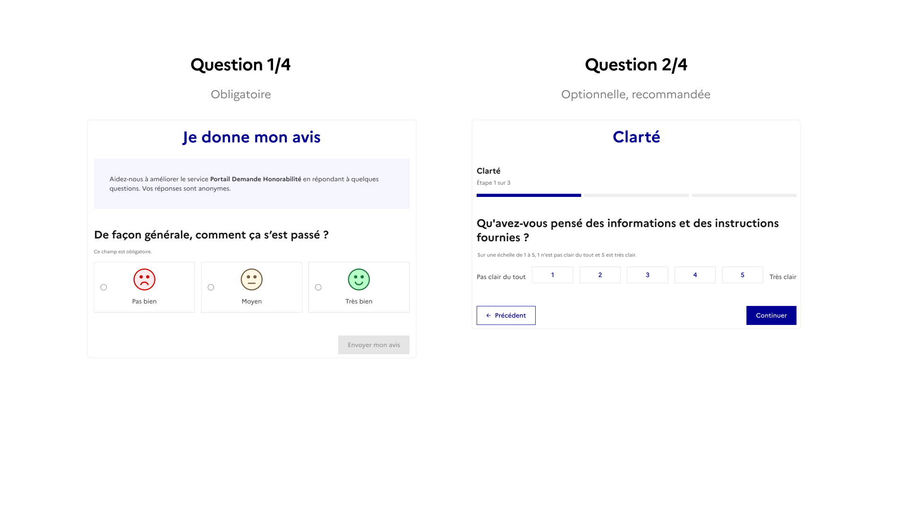
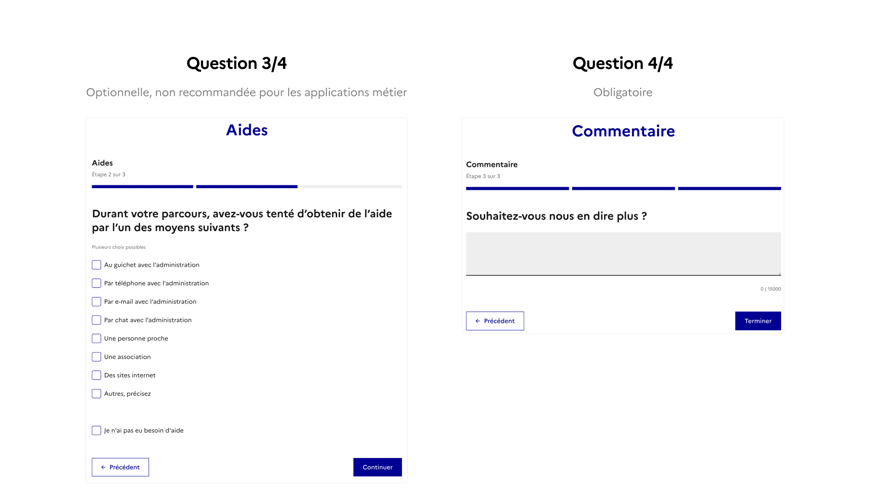

# Mesurer la satisfaction avec le bouton JDMA

Le bouton Je donne mon avis (JDMA) est un module standardisé, intégré dans les sites ou applications publiques, composé de quatre étapes principales qui permet aux usagers et agents de donner un retour rapide sur la qualité d’un service numérique de l’État.

Le bouton JDMA répond à plusieurs exigences des circulaires du 7 et 13 juillet 2023 (DINUM et SIG) :

* Mesurer la satisfaction des usagers directement depuis les interfaces de service.
* Recueillir des verbatim exploitables pour guider les améliorations continues.
* Contribuer à l’objectif interministériel : atteindre un indice de satisfaction supérieur à 8/10.
* Appuyer la conception centrée usager et l’évaluation qualitative du parcours.

> Son intégration est obligatoire pour les démarches recensées dans l’[Observatoire de la qualité des services numériques](https://observatoire.numerique.gouv.fr/), et fortement recommandée pour les autres produits et outils numériques de l’État.


A noter :&#x20;

* Le bouton s'intègre directement dans votre site en une ligne de code. Ce code contient même le visuel qui s'affichera automatiquement sur votre site. C'est fait en 5 minutes !&#x20;
* Le bouton n'impacte pas votre score RGAA et est compatible avec le DSFR.
* En cas de doute sur l'utilisation, l'emplacement ou la sémantique contactez votre responsable du design ou son équipe.&#x20;


Ressources et références :

* [https://jedonnemonavis.numerique.gouv.fr/](https://jedonnemonavis.numerique.gouv.fr/)
* [Circulaire 6411-SG du 7 juillet 2023](https://www.systeme-de-design.gouv.fr/version-courante/fr/premiers-pas/perimetre-d-application)
* [Note d'application de la DINUM](https://www.systeme-de-design.gouv.fr/static/file/Note_DINUM_qualite_des_services_numeriques_17_07_2023.pdf)
* [Fichier Figma avec les ressources visuelles de cette page](https://www.figma.com/design/1F77YLcBVbNw4CCEUr9PSQ/Mod%C3%A8les-Social-Gouv--composants--pages-?node-id=4497-58322\&t=flzakH2os0yZBXc6-11)

<figure><figcaption></figcaption></figure>

<mark style="color:$info;">Bouton "Je donne mon avis", novembre 2025</mark>

***

### Questions du formulaire "Je donne mon avis"

<figure><figcaption></figcaption></figure>

<figure><figcaption></figcaption></figure>

#### **Détails des questions posées**

1. **Question 1 :** **Expérience générale**
   1. Question posée : _De façon générale, comment ça s’est passé ?_
   2. Note de satisfaction de 1 à 3. Cette note est transformée en note sur 10 (1=0, 2=5, 3=10), la moyenne sur 10 est communiquée.
2. **Question 2 :** **Clarté (optionnelle, recommandée)**
   1. Question posée : _Qu’avez-vous pensé des informations et des instructions fournies ?_
   2. Sur une échelle de 1 à 5, 1 n'est pas clair du tout et 5 est très clair.
   3. Cette question est optionnelle mais recommandée pour tous les utilisateurs.
3. **Question 3 :** **Aide (optionnelle, non recommandée pour les applications métier)**
   1. Questions posées :
      1. _Durant votre parcours, avez-vous tenté d’obtenir de l’aide par l’un des moyens suivants ? (plusieurs choix possibles)_
      2. _Quand vous avez cherché de l’aide, avez-vous réussi à joindre l’administration ? (oui/non, ne s'affiche que si l'utilisateur a coché une des options correspondantes dans la question précédente)_
      3. _Comment évaluez-vous la qualité de l’aide que vous avez obtenue de la part de l’administration ? (Sur une échelle de 1 à 5 : Très mauvais à Excellente, cette question ne s'affiche que si l'utilisateur a coché une des options correspondantes dans la question précédente)_
   2. Utilisation :
      1. Recommandée pour les usagers particuliers et professionnels
      2. Non recommandée pour les agents
4. **Question 4 :** **Commentaire libre**
   1. Question posée : Souhaitez-vous nous en dire plus ?
   2. C’est la partie la plus précieuse pour les équipes : elle recueille des verbatim exploitables pour identifier les irritants et prioriser les améliorations.

### Où placer le bouton ?

En fonction de votre site, il y a deux emplacements à considérer :

* En fin de démarche,
* En bas de page ou là où l'usager peut donner une impression globale sans interrompre son usage.

Le bon emplacement va dépendre du type de produit et de sa cible principale :

* Types de produits : démarche ou vitrine/applicatif
* Publics cibles :
  * Grand public (usagers particuliers et professionnels),
  * Interne (agents ou partenaires).

<figure><figcaption></figcaption></figure>

<mark style="color:$info;">Emplacement générique et modification du formulaire en fonction du public et du type de site</mark>

***

### Intégration sur votre site

Le module s’intègre via un script unique, disponible sur [https://jedonnemonavis.numerique.gouv.fr/](https://jedonnemonavis.numerique.gouv.fr/)

* Connectez vous sur le site JDMA
* Ajoutez un service **en suivant la nomenclature suivante** \[Ministères Sociaux] DAC A DAC B DAC C - Nom du produit. Exemples :
  * \[Ministères Sociaux] DGCS DGS - VAO,
  * \[Ministères Sociaux] DNUM - Portail de connexion à ProConnect
* Suivez les étapes de création de votre formulaire.
* Prenez le code fourni à ajouter directement dans votre site.
* Les retours collectés sont consultables en ligne par produit et exportables pour analyse.
* Ajoutez l'adresse jdma@sg.social.gouv.fr en consultation de votre site


A noter : vous pouvez faire plusieurs emplacements du même lien et suivre la satisfaction associée.


***

### Exemples

1. Placement du bouton JDMA en fin de démarche. Placer le bloc du bouton en fin après les informations essentielles pour l'utilisateur. S'assurer que le bloc qui contient le bouton JDMA est aligné avec le corps de page.

<figure><figcaption></figcaption></figure>

2. Placement en bas de page. Positionner juste au dessus du footer.

<figure><figcaption></figcaption></figure>

