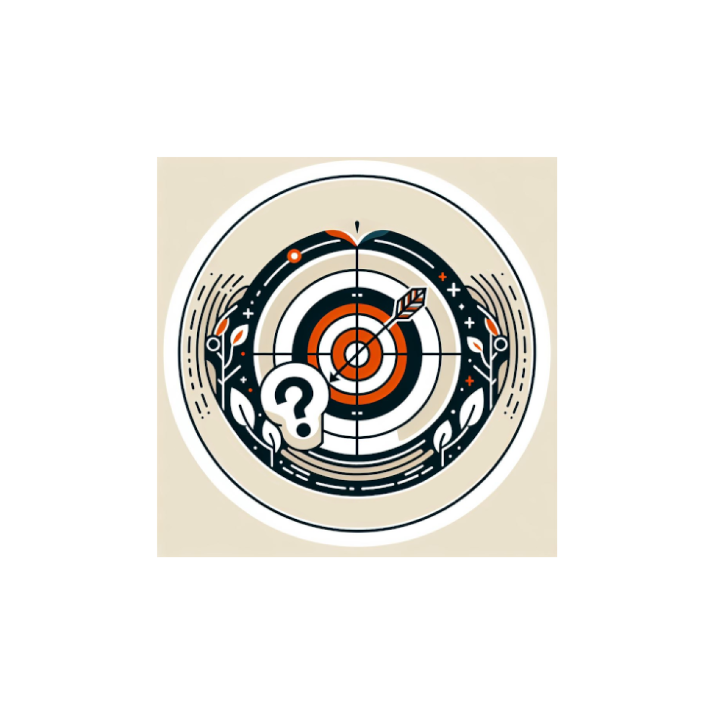

# 🧭 Orientation vers des offres adaptées

<figure><figcaption></figcaption></figure>

Perdu dans les offres d'accompagnement ?

**Pas de panique, cette offre est là pour ça.**

_Passerelle vers les offres DNUM ou D\&D adaptées._

_<mark style="color:red;">#VULGARISATION #QUESTION\_OUVERTE #JE\_SUIS\_PERDU</mark>_

***

* **Délai d'intervention :** 2 semaines
* **Durée d'intervention :** 1 jour
* **Cycle de vie du produit :** À tout moment

**Livrables :**

* Identification des principaux sujets avec leurs enjeux et risques.
* Orientation vers une ou plusieurs offres D\&D et DNUM.

**Conditions de réussite :**

* Collaboration étroite avec l'équipe produit, pour comprendre la problématique et son contexte.

**Ce que nous ne faisons pas :**

* Solliciter ou coordonner les offres identifiées : c'est à l'équipe produit de jouer !
