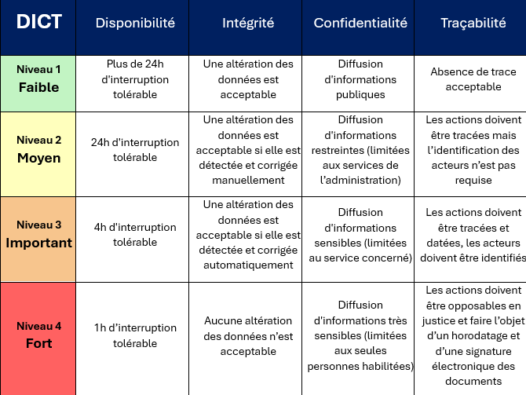

# 🔒 DICT (EBIOS)

L'ANSSI définit la méthode de référence EBIOS de gestion des risques.
En complément, la ConfNum (SSI DNUM) édite la matrice DICT suivante, pour identifier les besoins de sécurité :
<figure></figure>

En voici une aide à la lecture pour les produits :

## Disponibilité
Voici quelques grands repères pour orienter :
*	D2 convient généralement au back-office (applications internes type SIRH, application de gestion pour les agents).
*	D3 convient généralement aux télé-procédures à destination des entreprises (ex : démarches travail) et associations, voire à certaines démarches pour les particuliers (ex : SI Honorabilité)
*	D4 convient généralement pour les sites grand publics consultés à tout moment (ex : arretonslesviolences.gouv.fr)

Quelques nuances :
*	La disponibilité du système dépend à la fois de la **résilience technique** (haute-disponibilité, tolérance à la panne, mode dégradé...) et de la **réactivité du support technique** (technicien infogérant, administrateur système, équipe produit...).
*	L’application n’a pas forcément la même exigence de disponibilité en semaine et le week-end.
*	L’application n’a pas forcément la même exigence de disponibilité en front-office et en back-office

## Intégrité
*	I2 suffit à la grande majorité des applications métier. Il s’agit ici de détecter l’altération des données _a priori ou posteriori_ (fichier tronqué, transaction BDD en échec, contrôles de cohérence...) via les mécanismes habituels d’observabilité (logs d’erreurs, alerte email...)
*	I4 implique un contrôle accru de l’intégrité des données _a priori_ (checksum, preuve mathématique, etc.)
*	I3 et sa correction automatique des données n'a que peu de réalité technique. Les technologies distribuées type NoSQL et Blockchain sont très peu présentes dans notre contexte, bien que le "consensus" permette parfois de corriger automatiquement la corruption d’un ou plusieurs nœuds.

## Confidentialité
* C3 couvre la majorité de nos applications métier, car c'est le niveau qui implique une gestion des droits d'accès (type RBAC).
* C4 convient particulièrement à la protection des publics les plus vulnérables (ex : Mandoline, SIRENA, DOMIFA) et aux sujets de démocratie (ex : TPE).

_A noter qu'il n'y a pas d'équivalence automatique entre le DICT et la norme HDS pour l'hébergement de données de santé. Néanmoins dans le cadre de données nominatives de santé, on s'attend naturellement à avoir un niveau de confidentialité C3 ou C4.

## Traçabilité et Preuve
*	T4 nécessite la signature électronique et l’horodatage **par un service externe certifié**.
* La documentation EBIOS insiste sur la traçabilité métier et l'imputabilité des actes de gestion, mais il est essentiel de considérer aussi la traçabilité de l'administration technique des SI (accès, changements).\

_A noter que la DNUM utilise toujours le terme historique "DICT", mais il a depuis évolué en "DICP". Rechercher DICP sur Internet renvoie ainsi des contenus plus récents._
